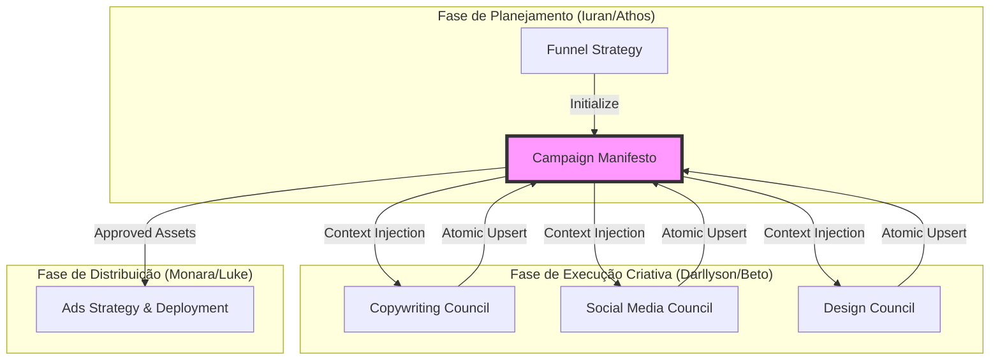

# 🔄 Fluxo de Dados: Atomic Handoff & State Sync (ST-11.22)

Este documento descreve o fluxo de dados entre os agentes e a persistência atômica no Manifesto da Campanha, garantindo a integridade da "Linha de Ouro" (Golden Thread) conforme definido em `_netecmt/contracts/campaign-handoff.md`.

## 1. Visão Geral da Linha de Ouro (Golden Thread)

A Linha de Ouro é o fio condutor que conecta a estratégia (Funil) à execução criativa (Copy, Social, Design) e finalmente ao monitoramento (Ads). O objetivo deste fluxo é garantir que cada agente tenha acesso ao contexto aprovado pelo agente anterior, eliminando alucinações e perda de dados.

## 2. Diagrama de Fluxo de Dados



## 3. Protocolo de Sincronia de Estado

A sincronia de estado é baseada em três pilares técnicos:

### A. Inicialização (Mapping de ID)
Ao transformar um Funil em uma Campanha, o sistema cria um novo documento na coleção `campaigns`:
- **ID da Campanha (`campaignId`)**: `funnelId + "_" + timestamp` (Garante unicidade para múltiplas execuções do mesmo funil).
- **Snapshot Inicial**: O manifesto herda os dados estáticos do funil (`type`, `architecture`, `audience`).

### B. Injeção de Contexto (Cross-Agent RAG)
Diferente da versão legacy, onde cada agente lia apenas o prompt base, agora cada conselho recebe o **Manifesto Atualizado**:
1. **Conselho de Social**: Recebe no `system_message` a `Big Idea` e os `Key Benefits` aprovados na Copy.
2. **Conselho de Design**: Recebe os `Hooks` e a `Plataforma` aprovados no Social, além de todo o contexto anterior.

### C. Persistência Atômica (Atomic Upsert)
Para evitar perda de sincronia (Race Conditions), as APIs devem seguir o padrão:
```typescript
// Exemplo de atualização de Copy no Manifesto
await setDoc(campaignRef, {
  copywriting: {
    bigIdea: data.bigIdea,
    headlines: data.headlines,
    // ...
    updatedAt: serverTimestamp()
  },
  status: 'active'
}, { merge: true });
```

## 4. Guia de Liberação de Sincronia (Monara)

Como integrador, a Monara deve validar os seguintes pontos antes da liberação de cada módulo:

| Validação | Requisito | CLI / Ferramenta |
| :--- | :--- | :--- |
| **Integridade de ID** | O `campaignId` deve ser diferente do `funnelId`. | `firestore get campaigns` |
| **Chain Visibility** | O agente de Design deve conseguir "ver" a Copy aprovada. | `context7 check-rag` |
| **Atomic Lock** | O frontend deve travar o botão de "Próximo" até que o `upsert` retorne 200. | Browser DevTools |
| **Metadata Audit** | Todo ativo deve conter o `counselor_reference` (IA que gerou). | `campaign-cli status` |

## 5. Tratamento de Erros e Rollback

1. **Falha no Upsert**: Se a persistência falhar, o estado do frontend deve reverter para "Draft" e notificar o usuário para tentar salvar novamente.
2. **Conflito de Versão**: O manifesto é a única "Fonte da Verdade". Em caso de divergência entre coleções locais (cache) e o Manifesto, o Manifesto sempre prevalece.

---
*Documentado por: Wilder (Analyst) em colaboração com Monara (Integrator)*
