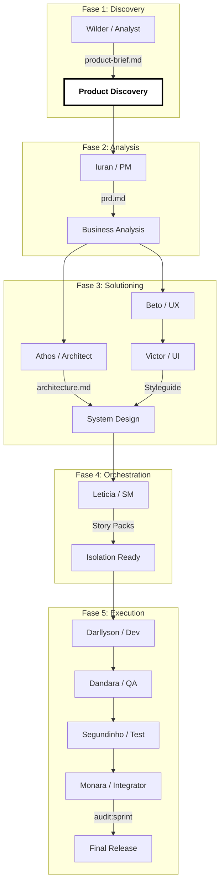

# Arquitetura de Precisão NETECMT

---

## 🚀 Eficiência e Antialucinação

- **Custo Tradicional**: Toda a base de código é enviada para a IA.
- **Eficiência NETECMT**: Apenas o Contrato e o Story Pack. Redução de **70% de Tokens**.
- **Antialucinação**: O Contrato de Lane serve como uma "viseira", impedindo a IA de inventar soluções fora do domínio.

---

## 🎨 Representação Visual (Infográfico)

---
*Este documento é a base técnica mandatória para a execução.*
