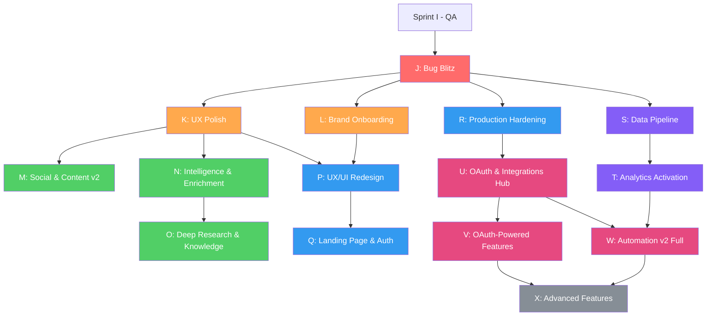

# Master Roadmap — Conselho de Funil

> **Versão:** 1.0
> **Data:** 2026-02-16
> **Contexto:** Reorganização pós-QA Sprint I, incorporando 8 roadmaps v2
> **Sprints A-H:** CONCLUÍDOS | **Sprint I:** QA em andamento | **Sprints J+:** Este documento

---

## 1. Resumo Executivo

| Métrica | Valor |
|---------|-------|
| **Total de sprints** | 15 (J a X) |
| **Sessões estimadas** | ~38-50 |
| **Milestones** | 5 (Friends Testing → Feature Complete → Public Launch → Data-Driven → Full Platform) |
| **Roadmaps v2 incorporados** | 8 (Social, Automation, Calendar, Brand Hub, Assets, Vault, Settings, Product Launch) |
| **Referência adicional** | SEO APIs (DataForSEO/Glimpse) |
| **Sprints originais J-M** | Redistribuídos (ver seção 7) |

### Lógica da reorganização

Os sprints J-M originais foram criados ANTES dos roadmaps v2 e seguiam a sequência:
`UX Polish → Tool Integration → Data Pipeline → Analytics`

Os roadmaps v2 revelaram que:
1. Existem **bugs críticos** em 7 módulos que precisam ser corrigidos ANTES de qualquer evolução
2. O **onboarding está fragmentado** — usuário novo não entende o que fazer
3. **Settings não salvam** (5/6 tabs são fake save) — problema de confiança
4. O **Data Pipeline** (tracking pixel, webhooks) precisa de usuários reais para testar — inútil para amigos testers
5. **OAuth** é blocker gigante que afeta 6+ módulos — agrupar no final

A nova sequência prioriza: `Corrigir bugs → Polir UX → Onboarding → Evoluir features → Redesign visual → Presença pública → Hardening → Data pipeline → Analytics → OAuth → Features avançadas`

---

## 2. Tabela de Sprints

| Sprint | Título | Escopo | Dependências | Sessões | Milestone |
|--------|--------|--------|-------------|---------|-----------|
| **J** | Bug Blitz | Corrigir bugs críticos em 7 módulos | Sprint I concluído | ~2 | 🎯 Friends |
| **K** | UX Polish & User Readiness | Tornar features existentes compreensíveis | J | ~2-3 | 🎯 Friends |
| **L** | Brand Onboarding & First Experience | Wizard expandido, checklist, empty states | J | ~2-3 | 🎯 Friends |
| **M** | Social & Content v2 | Social wizard, debate do conselho, calendário integrado | K | ~3-4 | ⭐ Feature Complete |
| **N** ✅ | Intelligence & Enrichment | Keywords, Spy Agent, Forensics, Vault Autopilot, DataForSEO | K | ~3-4 | ⭐ Feature Complete |
| **O** | Deep Research & Knowledge Base | Research v2, audiência, RAG, trends, base de conhecimento | N | ~3-4 | ⭐ Feature Complete |
| **P** | UX/UI Redesign | Nova identidade, paleta, design tokens, navegação | K, L | ~3-4 | 🚀 Public Launch |
| **Q** | Landing Page & Auth | Página pública, termos, email verification | P | ~2-3 | 🚀 Public Launch |
| **R** | Production Hardening | Segurança, performance, monitoring, LGPD | J | ~2-3 | 🚀 Public Launch |
| **S** | Data Pipeline Foundation | Tracking pixel, webhooks, lead journey, ads sync | J | ~4-5 | 📊 Data-Driven |
| **T** | Analytics Activation | Attribution, LTV, Cohort, Real-Time, Cross-Channel | S | ~2-3 | 📊 Data-Driven |
| **U** | OAuth & Integrations Hub | OAuth flows (Meta/Google/TikTok), Central de Integrações | R | ~3-4 | 🏗️ Full Platform |
| **V** | OAuth-Powered Features | Publicação real, Social Command Center, Import de criativos | U | ~3-4 | 🏗️ Full Platform |
| **W** | Automation v2 Full & Content Analytics | Regras compostas, conselho de ads, execução real, feedback loop | U, T | ~3-4 | 🏗️ Full Platform |
| **X** | Advanced Features & Polish | Voice avançado, DNA, A/B testing, versionamento, Glimpse | V, W | ~2-3 | 🏗️ Full Platform |

---

## 3. Diagrama de Dependências



### Legenda
- 🔴 **Vermelho (J):** Urgente — bugs críticos
- 🟠 **Laranja (K, L):** Alta prioridade — preparação para testers
- 🟢 **Verde (M, N, O):** Features v2 — completude funcional
- 🔵 **Azul (P, Q, R):** Launch prep — público e produção
- 🟣 **Roxo (S, T):** Data pipeline — analytics real
- 🔴 **Rosa (U, V, W):** OAuth-dependent — integrações reais
- ⚫ **Cinza (X):** Nice-to-have — polish final

### Versão ASCII (alternativa)

```
Sprint I (QA)
    │
    ▼
┌──[J: Bug Blitz]──────────────────────────┐
│          │              │                  │
▼          ▼              ▼                  ▼
[K: UX]  [L: Onboarding] [R: Hardening]   [S: Data Pipeline]
│    │         │               │                  │
│    ▼         │               │                  ▼
│  [M: Social] │               │            [T: Analytics]
│    │         │               │                  │
▼    │         │               ▼                  │
[N: Intel]     │         [U: OAuth Hub]───────────┘
│              │           │         │
▼              │           ▼         ▼
[O: Research]  │    [V: OAuth Feat] [W: Automation v2]
               │           │         │
               ▼           ▼         ▼
             [P: UX/UI]  [X: Advanced Features]
               │
               ▼
             [Q: Landing]

Paralelos possíveis:
  • K ∥ L ∥ R ∥ S (todos só dependem de J)
  • M ∥ N (ambos dependem de K)
  • P pode iniciar ao final de K+L
  • R pode rodar em paralelo com quase tudo
  • S é independente do fluxo Social/Content
```

---

## 4. Detalhe de Cada Sprint

---

### Sprint J — Bug Blitz (Critical Fixes)

> **Estimativa:** ~2 sessões
> **Dependência:** Sprint I concluído
> **Milestone:** 🎯 Friends Testing
> **Princípio:** Corrigir tudo que engana o usuário ou impede uso básico

#### J-1. Settings — Conectar Saves Reais ✅
**Origem:** `roadmap-settings-v2.md` Fase 1
**Status:** CONCLUÍDO (2026-02-16) — Commits `1869f0ab7` + `efd898764`

- [x] J-1.1 — **Tab Perfil:** State controlado para `displayName`, `updateProfile()` Firebase Auth, upload avatar via Storage (max 2MB), preview de photoURL
- [x] J-1.2 — **Tab Negócio:** Removido form duplicado → substituído por link ao Brand Hub (campos duplicavam wizard de criação de marca)
- [x] J-1.3 — **Tab Segurança:** 3 campos (atual, nova, confirmar) + `reauthenticateWithCredential()` + `updatePassword()` + validação (8 chars, 1 maiúscula, 1 número) + tratamento de erros
- [x] J-1.4 — **Tab Notificações:** Toggles conectados a state + persistência Firestore `users/{uid}.preferences.notifications` (localStorage como cache)
- [x] J-1.5 — **Tab Aparência:** Tema dark/light/sistema real + branding persistido em Firestore `users/{uid}.preferences.branding` (localStorage como cache)

**Mudanças adicionais:**
- Tipo `UserPreferences` adicionado a `database.ts`
- Helpers `getUserPreferences()` e `updateUserPreferences()` em `firestore.ts`
- `BrandingProvider` carrega do Firestore como source of truth
- 14 comentários MVP removidos em 11 arquivos

**Arquivos:** `app/src/app/settings/page.tsx`, `app/src/components/providers/branding-provider.tsx`, `app/src/types/database.ts`, `app/src/lib/firebase/firestore.ts`

#### J-2. Assets — Fix 3 Bugs Críticos ✅
**Origem:** `roadmap-assets-v2.md` Fase 1
**Status:** CONCLUÍDO (2026-02-16) — Commit `5ea20cb8f`

- [x] J-2.1 — **Asset invisível:** Metrics API agora consulta Firestore como source of truth + merge com Pinecone. Badges de status processing/error. Fix unwrap do envelope `createApiSuccess` no hook
- [x] J-2.2 — **LogoLock undefined:** Optional chaining + `|| null` nos variants. Filter undefined/null antes de `updateDoc()` em `brand-kit-form.tsx` e `brand-governance.ts`
- [x] J-2.3 — **Botão delete:** Trash2 em 3 layouts do `metrics-table.tsx` + `asset-detail-modal.tsx`. Novo endpoint `api/assets/delete` (Firestore + Storage + Pinecone). Nova fn `deleteFromPinecone()` em `pinecone.ts`
- [x] J-2.4 — **aria-describedby:** `<DialogDescription>` em 3 arquivos: `asset-detail-modal.tsx`, `assets/page.tsx`, `brands/[id]/assets/page.tsx`

**Arquivos:** `api/assets/metrics/route.ts`, `api/assets/delete/route.ts` (novo), `brand-kit-form.tsx`, `brand-governance.ts`, `metrics-table.tsx`, `asset-detail-modal.tsx`, `assets/page.tsx`, `brands/[id]/assets/page.tsx`, `pinecone.ts`, `use-asset-metrics.ts`

#### J-3. Calendar — Fix Error 500 ✅
**Origem:** `roadmap-calendar-v2.md` Fase 1.1
**Status:** CONCLUÍDO (2026-02-16) — Commit `76417184c`

- [x] J-3.1 — Extrair `requireBrandAccess` para try/catch separado com `handleSecurityError()` em TODOS os handlers de `calendar/route.ts` (GET, POST, PUT, DELETE). Adicionado import de `handleSecurityError`. Removido `if (error instanceof Response)` inútil
- [x] J-3.2 — Aplicar mesmo fix em `reorder/route.ts` (1 handler POST)
- [x] J-3.3 — Aplicar mesmo fix em `approve/route.ts` (1 handler POST)
- [x] J-3.4 — Aplicar mesmo fix em `generate/route.ts` (1 handler POST). Removido `if (error instanceof Response)` inútil

**Bug:** `requireBrandAccess()` lança `ApiError` (extends `Error`), mas catch verificava `instanceof Response` — nunca true. Todos os erros 401/403/404 caíam no 500 genérico.
**Fix:** Try/catch separado para auth com `handleSecurityError()`, padrão já usado em 15+ routes (social/hooks, chat, design, admin, etc.)

**Arquivos:** `api/content/calendar/route.ts`, `reorder/route.ts`, `approve/route.ts`, `api/content/generate/route.ts`

#### J-4. Automation — Fix Valores Hardcoded ✅
**Origem:** `roadmap-automation-v2.md` Fase 1
**Status:** CONCLUÍDO (2026-02-16) — Commit `3c0776ea8`

- [x] J-4.1 — **"142 Ações" → dados reais:** `executedLast24h.length` filtrando logs com `status === 'executed'` e timestamp nas últimas 24h
- [x] J-4.2 — **"R$ 12.450" → dados reais ou "—":** Soma de `adjustmentValue` das rules linkadas a logs `adjust_budget` executados, ou "—" + "Nenhum ajuste nas últimas 24h"
- [x] J-4.3 — **"+12% vs ontem" → removido:** Sem dados históricos para comparação. Substituído por "Últimas 24 horas"
- [x] J-4.4 — **Copy Refactor → autópsia real ou empty state:** Busca última autópsia da brand via Firestore (`brands/{brandId}/autopsies`). Se existe, extrai `frictionPoint` das recommendations e `originalContext` do summary. Se não, mostra empty state com orientação
- [x] J-4.5 — **Cron já configurado:** `vercel.json` já contém `/api/cron/automation-evaluate` com schedule `0 * * * *` (a cada hora). Nenhuma alteração necessária

**Extras corrigidos:**
- "Última Execução: 2h atrás" hardcoded nos cards de regras → `getLastExecution(ruleId)` com tempo relativo real
- "Economia estimada: R$ 2.100" → removido (sem dados de budget real)

**Arquivos:** `automation-control-center.tsx`, `automation/page.tsx`

#### J-5. Social — Fix CSS Overlap ✅
**Origem:** `roadmap-social-v2.md` Fase 1.1
**Status:** CONCLUÍDO (2026-02-16)

- [x] J-5.1 — Fix sobreposição de texto no `structure-viewer.tsx`: coluna esquerda `md:w-32` → `md:w-36` + `overflow-hidden`, Badge com `max-w-full truncate`, coluna direita com `min-w-0` para respeitar flex layout

**Arquivo:** `app/src/components/social/structure-viewer.tsx`

#### J-6. Brand Hub — Fix AI Config Desconectado ✅
**Origem:** `roadmap-brand-hub-v2.md` Fase 2
**Status:** CONCLUÍDO (2026-02-16)

- [x] J-6.1 — **Content Generation:** `generation-engine.ts` — `temperature: 0.7` → `brand.aiConfiguration?.temperature || 0.7` + `topP: brand.aiConfiguration?.topP || 0.95`
- [x] J-6.2 — **Ad Generation:** `ad-generator.ts` — mesmo fix + `getBrand(brandId)` adicionado para buscar config
- [x] J-6.3 — **Copy Generation:** `copy-gen.ts` — `topP: brand.aiConfiguration?.topP || 0.95` adicionado
- [x] J-6.4 — **Personality Injection:** `PERSONALITY_INSTRUCTIONS` criado em `formatters.ts` com 4 perfis (agressivo/sóbrio/criativo/equilibrado). `getPersonalityInstruction()` helper exportado. Injetado nos 3 engines (Content, Ad, Copy). Brand Compliance NÃO alterado (temperature 0.1 intencional)
- [x] J-6.5 — `presencePenalty` e `frequencyPenalty` removidos de `database.ts` (Gemini não suporta, eram campos mortos da OpenAI)

**Arquivos:** `generation-engine.ts`, `ad-generator.ts`, `copy-gen.ts`, `formatters.ts`, `database.ts`

#### Critério de aprovação Sprint J

| # | Critério | Verificação |
|---|----------|-------------|
| 1 | Settings salvam dados reais em todas as tabs | Alterar nome, recarregar, verificar persistência |
| 2 | Assets: upload aparece na lista mesmo com falha de embedding | Upload arquivo problemático, verificar badge |
| 3 | Calendar: criar post não retorna 500 | POST com brandId válido |
| 4 | Automation: zero valores hardcoded visíveis | Grep por "142", "12.450", "+12%" |
| 5 | AI config respeita temperature/topP da brand | Criar marca com preset "Agressivo", gerar copy, comparar tom |

---

### Sprint K — UX Polish & User Testing Readiness

> **Estimativa:** ~2-3 sessões
> **Dependência:** Sprint J concluído
> **Milestone:** 🎯 Friends Testing
> **Princípio:** Eliminar "falsos negativos" — features que funcionam mas parecem quebradas

#### K-1. Offer Lab — Guia de UX & Feedback Contextual ✅
**Origem:** Sprint J original, tarefa J-1 (Issue #16)
**Status:** CONCLUÍDO (2026-02-16)

- [x] K-1.1 — Tooltip/callout nos sliders Hormozi: "Estes sliders controlam 80% do score"
- [x] K-1.2 — Inverter labels Tempo/Esforço (slider alto = "Rápido/Fácil" = score ALTO)
- [x] K-1.3 — Feedback contextual abaixo do score explicando POR QUE está baixo
- [x] K-1.4 — Melhorar defaults: 8/8/2/2 para score inicial motivador
- [x] K-1.5 — Mini-guia "Como funciona a Equação de Valor" com visual da fórmula Hormozi

**Arquivos:** `offer-lab-wizard.tsx`
**Restrição:** NÃO alterou fórmula do calculator.ts nem formato de save no Firebase

#### K-2. Campaign Command Center — Experiência de Conclusão ✅
**Origem:** Sprint J original, tarefa J-2 (Issue #8)
**Status:** CONCLUÍDO (2026-02-16)

- [x] K-2.1 — Detectar estado "campanha completa" (5 stages approved)
- [x] K-2.2 — Card de conclusão: resumo executivo dos assets + celebração visual (Trophy icon, AnimatePresence)
- [x] K-2.3 — Botão "Gerar Campaign Brief" consolidando assets aprovados
- [x] K-2.4 — Seção "Próximos Passos" com checklist prático (5 items com links)
- [x] K-2.5 — Botão "Exportar Brief" (copy to clipboard + download .txt)

**Arquivo:** `app/src/app/campaigns/[id]/page.tsx`

#### K-3. Funnel Autopsy → Page Forensics (Rename) ✅
**Origem:** Sprint J original, tarefa J-3 (Issue #14, Nível 1)
**Status:** CONCLUÍDO (2026-02-16)

- [x] K-3.1 — Renomear de "Autópsia de Funil" para "Forensics de Página" em toda a UI
- [x] K-3.2 — Atualizar descrição para escopo real: "Análise profunda de uma página específica"
- [x] K-3.3 — Nota: "Quer analisar funil completo? Em breve: Funnel Journey Analysis"
- [x] K-3.4 — Atualizar sidebar/nav consistentemente (constants.ts: page-forensics)

**Arquivos:** `app/src/app/strategy/autopsy/page.tsx`, `app/src/lib/constants.ts`

#### K-4. Deep Research — Conexão Mínima com Brand ✅
**Origem:** Sprint J original, tarefa J-4 (Issue #17)
**Status:** CONCLUÍDO (2026-02-16)

- [x] K-4.1 — Verificado: dossiê em `brands/{id}/research` acessível via `listResearch()`, expiresAt só cache
- [x] K-4.2 — Seção "Dossiês Anteriores" com auto-load, show/hide toggle para 5+ items, date formatting
- [x] K-4.3 — Botão "Salvar Insights na Marca" → `updateDoc(brands/{brandId}, { researchInsights })` com toast
- [x] K-4.4 — Persistência confirmada: expiresAt usado apenas por getCachedResearch(), dados são permanentes

**Arquivos:** `research/page.tsx`

#### K-5. Calendar — Melhorias de Modal e Approval UI ✅
**Origem:** `roadmap-calendar-v2.md` Fase 1.2-1.3
**Status:** CONCLUÍDO (2026-02-16)

- [x] K-5.1 — Modal melhorado: campo conteúdo/descrição (textarea), seletor de horário (time input), close button
- [x] K-5.2 — Approval Engine integrada: modal de detalhe com ações por status (submit_review/approve/reject/schedule) via POST /api/content/calendar/approve
- [x] K-5.3 — Status visual corrigido: approved = emerald/green, published = blue (eram invertidos)

**Arquivos:** `content/calendar/page.tsx`, `calendar-view.tsx`

#### K-6. Assets — Status Real e Limpeza de Mock ✅
**Origem:** `roadmap-assets-v2.md` Fase 2
**Status:** CONCLUÍDO (2026-02-16)

- [x] K-6.1 — Substituir CTR/Conversão/ROI mock por `metrics: asset.metrics || null`
- [x] K-6.2 — Remover "+2.4%" hardcoded de `metrics-summary.tsx` (trend block removido)
- [x] K-6.3 — Seção "Recentemente Adicionados" com barra de progresso (processing) e status badges (ready/error)
- [x] K-6.4 — Botão "Reprocessar" para assets com status `error` (onReprocess callback prop)

**Arquivos:** `api/assets/metrics/route.ts`, `metrics-summary.tsx`

#### Critério de aprovação Sprint K

| # | Critério | Verificação |
|---|----------|-------------|
| 1 | Offer Lab: usuário entende que sliders controlam score | Teste com 2+ pessoas |
| 2 | Campaign: conclusão gera brief visível | Completar 1 campanha |
| 3 | Autopsy: nome atualizado em toda UI | Navegação sem confusão |
| 4 | Research: dossiês anteriores visíveis | Gerar 2+ dossiês |
| 5 | Calendar: criar/aprovar post funciona | Fluxo end-to-end |
| 6 | Assets: zero métricas mock visíveis | Grep por valores suspeitos |

---

### Sprint L — Brand Onboarding & First Experience

> **Estimativa:** ~2-3 sessões
> **Dependência:** Sprint J concluído (pode rodar em paralelo com K)
> **Milestone:** 🎯 Friends Testing
> **Princípio:** Usuário novo consegue configurar marca completa sem se perder

#### L-1. Wizard de Criação Expandido (6-7 Steps) ✅ CONCLUÍDO
**Origem:** `roadmap-brand-hub-v2.md` Fase 1

- [x] L-1.1 — Manter steps atuais: Identity → Audience → Offer
- [x] L-1.2 — **Novo Step 4: Visual Identity** — Cores (primary, secondary, accent), visual style, tipografia
- [x] L-1.3 — **Novo Step 5: Logo** — Upload com preview, Logo Lock toggle
- [x] L-1.4 — **Novo Step 6: AI Configuration** — Preset rápido (Agressivo/Sóbrio/Criativo/Equilibrado)
- [x] L-1.5 — **Step 7: Confirmação** — Review completo de TODOS os dados
- [x] L-1.6 — Cada step OPCIONAL (exceto Identity) com "Pular por agora"
- [x] L-1.7 — Progress bar de completude da marca

**Arquivo:** `app/src/app/brands/new/page.tsx`
**Novos:** `step-visual-identity.tsx`, `step-logo.tsx`, `step-ai-config.tsx`

#### L-2. Brand Completeness Score ✅ CONCLUÍDO
**Origem:** `roadmap-brand-hub-v2.md` Fase 1.2

- [x] L-2.1 — Indicador visual na listagem e header: "Marca 60% configurada"
- [x] L-2.2 — Nudge: "Complete o Brand Hub para resultados melhores"
- [x] L-2.3 — Campos rastreados: nome, audience, offer, cores, logo, AI config, assets

**Arquivo novo:** `app/src/components/brands/brand-completeness.tsx`
**Utilitário:** `app/src/lib/utils/brand-completeness.ts`

#### L-3. Eliminar Duplicação brand-hub vs brands/[id] ✅ CONCLUÍDO
**Origem:** `roadmap-brand-hub-v2.md` Fase 1.3

- [x] L-3.1 — Manter `/brands/{id}` com tabs como página principal (+ suporte `?tab=`)
- [x] L-3.2 — Redirecionar `/brand-hub` para `/brands/{selectedBrandId}` tab Brand Hub

#### L-4. Onboarding Pós-Signup ✅ CONCLUÍDO
**Origem:** `roadmap-product-launch.md` Parte 3, Seção E

- [x] L-4.1 — Welcome screen após signup: explicação rápida do produto (30s)
- [x] L-4.2 — Primeira ação guiada: "Consultar o Conselho" OU "Criar funil" OU "Analisar concorrente"
- [x] L-4.3 — Checklist persistente no sidebar: itens de setup com progresso %
- [x] L-4.4 — Fix Quick Action "/library" (rota verificada — existe em `/app/src/app/library/page.tsx`)

**Novos:** `welcome/page.tsx`, `onboarding-store.ts`, `onboarding-checklist.tsx`

#### L-5. Empty States Guiados ✅ CONCLUÍDO
**Origem:** `roadmap-product-launch.md` Parte 3, Seção E.3

- [x] L-5.1 — Cada página com 0 items: explicação + CTA + mini tutorial
- [x] L-5.2 — Exemplos: Calendar vazio → "Crie seu primeiro conteúdo", Assets vazio → "Faça upload do brand book"
- [x] L-5.3 — Dashboard redesign para novos usuários (cards informativos em vez de zeros)

**Novo:** `app/src/components/ui/guided-empty-state.tsx`

#### Critério de aprovação Sprint L

| # | Critério | Verificação |
|---|----------|-------------|
| 1 | Wizard cria marca com cores/logo/AI config | Criar marca completa pelo wizard |
| 2 | Completeness score funciona | Marca parcial mostra % correto |
| 3 | /brand-hub redireciona corretamente | Navegar para /brand-hub |
| 4 | Usuário novo recebe guia pós-signup | Criar conta nova e seguir fluxo |
| 5 | Empty states presentes em todas as páginas principais | Verificar 5+ páginas com 0 items |

---

### 🎯 MILESTONE: Friends Testing Ready (após J + K + L)

> **Estimativa acumulada:** ~6-9 sessões
> **Resultado:** Produto funcional onde amigos testers conseguem criar marca, usar ferramentas, e dar feedback sobre funcionalidades (não sobre bugs ou confusão)

---

### Sprint M — Social & Content v2

> **Estimativa:** ~3-4 sessões
> **Dependência:** Sprint K concluído
> **Milestone:** ⭐ Feature Complete
> **Princípio:** Transformar Social de "wrapper Gemini" em conselho estratégico real

#### M-1. Social — Seletor de Campanha e Content Plan ✅
**Origem:** `roadmap-social-v2.md` Fase 1 (1.2-1.4)
**Status:** CONCLUÍDO (2026-02-16)

- [x] M-1.1 — Step inicial antes da geração: Objetivo (Orgânico/Viral/Institucional/Conversão) + Formato + Plataformas — `social-wizard.tsx` Step 0 (Config) com 4 campaign types, 5 content formats, 5 plataformas
- [x] M-1.2 — Expandir output: hooks + tipos de post + calendário sugerido + pilares de conteúdo — SOCIAL_HOOKS_PROMPT agora retorna `content_plan` com `pillars` e `suggested_calendar`, cada hook tem `postType`
- [x] M-1.3 — Atualizar `SOCIAL_HOOKS_PROMPT` para incluir `campaignType` e `contentFormats` — Placeholders `{{campaignType}}` e `{{contentFormats}}` adicionados + seção "Alinhamento com Objetivo de Campanha"
- [x] M-1.4 — Expandir interface `CampaignContext.social` em `campaign.ts` — Adicionado `campaignType`, `contentFormats`, `contentPlan`, `debate`, `evaluation`

**Arquivos:** `social-wizard.tsx` (novo), `social-generation.ts`, `api/social/hooks/route.ts`, `campaign.ts`

#### M-2. Social — Debate do Conselho & Avaliação Calibrada ✅
**Origem:** `roadmap-social-v2.md` Fase 2
**Status:** CONCLUÍDO (2026-02-16)

- [x] M-2.1 — **Debate entre 4 conselheiros:** `api/social/debate/route.ts` usa `buildPartyPrompt()` + `buildPartyBrainContext()` com `SOCIAL_COUNSELOR_IDS`. PRO_GEMINI_MODEL, intensity 'debate'
- [x] M-2.2 — **DebateViewer component:** `debate-viewer.tsx` — Parser de debate → cards por conselheiro (avatar, cor, opinião) + veredito final (Gavel icon)
- [x] M-2.3 — **Scorecard calibrado:** `social-brain-context.ts` (padrão `ads-brain-context.ts`) — 4 experts mapeados a frameworks reais (hook_effectiveness, algorithm_alignment, viral_potential, social_funnel_score). `SOCIAL_SCORECARD_PROMPT` redesenhado com sub_scores por dimensão. `scorecard-viewer.tsx` atualizado para exibir counselor names, sub_scores bars, red_flags, gold_standards. Scorecard API migrado para PRO_GEMINI_MODEL
- [x] M-2.4 — **UX em 4 steps:** `social-wizard.tsx` — Config → Geração → Debate → Avaliação. Step progress bar clicável com estados completed/active/pending. `social/page.tsx` atualizado para usar SocialWizard

**Arquivos novos:** `api/social/debate/route.ts`, `debate-viewer.tsx`, `social-wizard.tsx`, `social-brain-context.ts`
**Modelo:** PRO_GEMINI_MODEL para debate e scorecard
**Créditos:** 2 (debate=1, scorecard=1)

#### M-3. Calendar — Integração com Social & Campaign ✅
**Origem:** `roadmap-calendar-v2.md` Fase 2
**Status:** CONCLUÍDO (2026-02-16)

- [x] M-3.1 — Hooks aprovados no Social → `api/content/calendar/from-social/route.ts` — Cria calendar items com título, formato (mapped), plataforma (mapped), metadata source='social_hooks'. Botão CalendarPlus no social-wizard.tsx por hook
- [x] M-3.2 — Etapa Social da Linha de Ouro aprovada → batch de items no calendário — Endpoint aceita array de hooks, agenda sequencialmente nos próximos 7 dias
- [x] M-3.3 — "Gerar semana inteira" — `api/content/calendar/generate-week/route.ts` — IA gera 5-7 posts baseado em pilares de conteúdo + brand context. DEFAULT_GEMINI_MODEL. Botão "Gerar Semana" no header do Calendar. 3 créditos

**Créditos:** 1 individual (from-social), 3 batch semanal (generate-week)

#### M-4. Calendar — Templates & Recorrência ✅
**Origem:** `roadmap-calendar-v2.md` Fase 3
**Status:** CONCLUÍDO (2026-02-16)

- [x] M-4.1 — Salvar posts aprovados como templates — `content-templates.ts` (Firestore CRUD: brands/{brandId}/content_templates) + `api/content/calendar/templates/route.ts` (GET/POST/DELETE). Botão "Salvar como Template" no modal de detalhe para items approved/published. Templates panel no Calendar com grid cards
- [x] M-4.2 — Posts recorrentes (diário, semanal, mensal) — `RecurrenceRule` type em content.ts + Firestore CRUD em `content-templates.ts` (brands/{brandId}/recurrence_rules). CRUD helpers: createRecurrenceRule, getActiveRecurrenceRules, updateRecurrenceRule, deleteRecurrenceRule
- [x] M-4.3 — Pilares de conteúdo (3-5 temas) distribuídos pelos dias da semana — `ContentPillar` type em content.ts + saveContentPillars/getContentPillars em content-templates.ts. Generate-week usa pilares como input. SOCIAL_HOOKS_PROMPT retorna pillars no content_plan

#### Critério de aprovação Sprint M

| # | Critério | Verificação |
|---|----------|-------------|
| 1 | Social: 4 conselheiros debatem com frameworks reais | Gerar hooks e ver debate |
| 2 | Scorecard usa pesos dos evaluation_frameworks | Comparar com scores antigos |
| 3 | Hooks aprovados aparecem no calendário | Aprovar hook → verificar calendar |
| 4 | Batch semanal gera 5+ posts | Gerar semana e verificar |

---

### Sprint N — Intelligence & Enrichment ✅ CONCLUÍDO

> **Estimativa:** ~3-4 sessões
> **Dependência:** Sprint K concluído (pode rodar em paralelo com M)
> **Milestone:** ⭐ Feature Complete
> **Princípio:** Conectar ferramentas isoladas em sistema integrado
> **Concluído em:** 2026-02-16

#### N-1. Keywords Miner — Integração com Brand & Engines ✅
**Origem:** Sprint K original, tarefa K-1 (Issue #9)

- [x] N-1.1 — Botão "Salvar no Brand" → `brands/{id}/keywords` com metadata (term, volume, difficulty, intent, source, savedAt)
- [x] N-1.2 — Função `getAllBrandKeywordsForPrompt(brandId)` — merges new + legacy collections, dedup by term
- [x] N-1.3 — Injetar keywords do brand no prompt de Copy Generate como contexto SEO
- [x] N-1.4 — Injetar keywords no prompt de Ads Generate (both routes)
- [x] N-1.5 — Ações pós-mineração na UI: "Salvar no Brand", "Salvar Todas", "Enviar para Conselho de Copy"
- [x] N-1.6 — Tab "Keywords Correlacionadas" via Gemini (LSI, longtail, perguntas)

**Limite:** máx 100 keywords por brand. Implementado com dedup.

**Arquivos:** `lib/firebase/intelligence.ts`, `api/intelligence/keywords/save/route.ts`, `api/intelligence/keywords/related/route.ts`, `components/intelligence/discovery/keywords-miner.tsx`, `api/copy/generate/route.ts`, `api/intelligence/creative/generate-ads/route.ts`, `api/campaigns/[id]/generate-ads/route.ts`

#### N-2. SEO — Integração DataForSEO (Dados Reais) ✅
**Origem:** `roadmap-seo-apis.md` Fase 2

- [x] N-2.1 — Criar `app/src/lib/integrations/seo/dataforseo.ts` (client + cache + normalizers)
- [x] N-2.2 — Substituir Gemini para volume/difficulty no `miner.ts` por DataForSEO (with fallback)
- [x] N-2.3 — Manter Gemini apenas para intent + suggestions (skipVolumeEstimation param)
- [x] N-2.4 — Cache 30 dias em Firestore `brands/{id}/seo_cache`
- [x] N-2.5 — Env vars: `DATAFORSEO_LOGIN` + `DATAFORSEO_PASSWORD` (graceful fallback if missing)

**Custo:** ~$12/mês para 200 usuários. Sem DataForSEO → Gemini estimate fallback.

#### N-3. Spy Agent v2 — Análise Estratégica ✅
**Origem:** Sprint K original, tarefa K-2 (Issue #10)

- [x] N-3.1 — Análise qualitativa Gemini Pro: strengths/weaknesses/emulate/avoid
- [x] N-3.2 — Detecção de design system: cores, tipografia, espaçamento, componentes UI
- [x] N-3.3 — Racionalização estratégica: 5-7 strategic rationale items
- [x] N-3.4 — Insights acionáveis: 3-5 ações concretas
- [x] N-3.5 — Botão "Salvar como Estudo de Caso" → `brands/{id}/case_studies` permanente
- [x] N-3.6 — Botão "Aplicar Insights" (stub → toast, contexto será conectado em Sprint O)

**Arquivos:** `lib/agents/spy/strategic-analysis.ts`, `api/intelligence/spy/route.ts`, `api/intelligence/case-studies/route.ts`, `components/intelligence/discovery/spy-agent.tsx`

#### N-4. Page Forensics — Integração com Pipeline ✅
**Origem:** Sprint K original, tarefa K-3 (Issue #14, Nível 2)

- [x] N-4.1 — "Salvar como Estudo de Caso Permanente" (sem TTL) em `case_studies`
- [x] N-4.2 — Aba "Biblioteca de Análises" na página Forensics com grid de cards
- [x] N-4.3 — Case studies compartilhados entre Spy e Forensics (mesmo schema)
- [x] N-4.4 — `formatCaseStudiesForPrompt()` ready for brain context injection
- [x] N-4.5 — Delete case study functionality

**Formato compartilhado:** N-3 e N-4 salvam em `case_studies` com mesmo schema (`types/case-studies.ts`, `lib/firebase/case-studies.ts`)

#### N-5. Creative Vault — Ativar Content Autopilot ✅
**Origem:** `roadmap-vault-v2.md` Fase 1

- [x] N-5.1 — **API Route** `api/content/autopilot/route.ts`: insights > 0.7 → CurationEngine → AdaptationPipeline → Review Queue
- [x] N-5.2 — **Botão manual "Run Autopilot"** na página do Vault (header + empty state)
- [x] N-5.3 — **Botões stub conectados:** "+ Novo Ativo" (toast info), "Histórico" (toast info)
- [x] N-5.4 — **Tab Configurações:** Autopilot settings, approval prefs, CRON info, OAuth note
- [x] N-5.5 — **CRON futuro:** referência em settings tab (configurar após validar manual)

**Fix adicional:** Removido `brandId = 'brand-1'` hardcoded → agora usa `useActiveBrand()`.

#### Critério de aprovação Sprint N

| # | Critério | Verificação |
|---|----------|-------------|
| 1 | Keywords salvas no brand | ✅ API save + batch save + UI buttons |
| 2 | Copy/Ads usam keywords do brand | ✅ getAllBrandKeywordsForPrompt injected |
| 3 | DataForSEO retorna volume/difficulty reais | ✅ With graceful fallback to Gemini |
| 4 | Spy Agent gera insights acionáveis | ✅ Strategic analysis via Gemini Pro |
| 5 | Estudo de caso persiste permanentemente | ✅ No TTL, shared schema |
| 6 | Content Autopilot cria items na Review Queue | ✅ Manual trigger via UI button |

---

### Sprint O — Deep Research & Knowledge Base

> **Estimativa:** ~3-4 sessões
> **Dependência:** Sprint N concluído
> **Milestone:** ⭐ Feature Complete
> **Princípio:** Transformar pesquisa genérica em inteligência de audiência acionável

#### O-1. Deep Research v2 — Prompts Estruturados & UX
**Origem:** Sprint K original, tarefa K-4 Fase A

- [ ] O-1.1 — Biblioteca de **task templates** clicáveis: "Análise de Audiência", "Análise de Concorrente", "Tendências", "Pesquisa de Produto", "Mapeamento de Nicho"
- [ ] O-1.2 — Cada template pré-preenche campos e ajusta profundidade/fontes
- [ ] O-1.3 — Campo "URLs Customizadas" para scraping específico (Instagram, YouTube, blogs)

#### O-2. Deep Research v2 — Análise de Audiência (Voz Ativa)
**Origem:** Sprint K original, tarefa K-4 Fase B

- [ ] O-2.1 — Parser de comentários sociais via Firecrawl (Instagram, YouTube, blogs)
- [ ] O-2.2 — Prompt Gemini para análise de voz ativa: tom, dores, desejos, perguntas, gatilhos
- [ ] O-2.3 — Gerar Persona de Audiência baseada em dados reais

#### O-3. Deep Research v2 — Chat de Refinamento & RAG
**Origem:** Sprint K original, tarefa K-4 Fases C-D

- [ ] O-3.1 — Aba de chat split-view ao lado do dossiê (perguntas, refinamentos, contexto extra)
- [ ] O-3.2 — Histórico de refinamentos salvo com o dossiê
- [ ] O-3.3 — Botão "Adicionar ao Conselho" — checkboxes por seção para RAG
- [ ] O-3.4 — Salvar seções como embeddings no Pinecone (768 dims, text-embedding-004)
- [ ] O-3.5 — Conselheiros buscam research context automaticamente ao gerar conteúdo
- [ ] O-3.6 — Indicador visual: "Usando insights de Deep Research: [nome do dossiê]"

**Modelo chat:** PRO_GEMINI_MODEL
**Limite:** máx 20 research chunks ativos por brand

#### O-4. Social — Pesquisa de Trends & Análise de Perfil
**Origem:** `roadmap-social-v2.md` Fase 3

- [ ] O-4.1 — **Trend Research:** Exa search ("trending [platform] content [vertical]") → Firecrawl enrich → Gemini síntese
- [ ] O-4.2 — **TrendPanel component:** Cards de trends com tags, growth indicators, links
- [ ] O-4.3 — **Competitor Profile Analysis:** Firecrawl scrape perfil público → Gemini analisa frequência, hooks, engajamento
- [ ] O-4.4 — **ProfileAnalyzer component:** Input URL → Report com strengths/weaknesses/patterns

**Créditos:** Trends=1, Profile Analysis=2

#### O-5. Social — Base de Conhecimento & Políticas
**Origem:** `roadmap-social-v2.md` Fase 4

- [ ] O-5.1 — Upload de documentos de políticas por plataforma (`docType: 'social_policy'`)
- [ ] O-5.2 — Upload de boas práticas (`docType: 'social_best_practices'`)
- [ ] O-5.3 — RAG filter para Social: policy, best_practices, case_study, por channel
- [ ] O-5.4 — Workaround Engine: debate consulta KB quando identifica conflito com política

#### Critério de aprovação Sprint O

| # | Critério | Verificação |
|---|----------|-------------|
| 1 | Task templates pré-preenchem corretamente | Testar 3+ templates |
| 2 | Análise de audiência gera persona útil | Analisar canal YouTube real |
| 3 | Chat refina dossiê com contexto | 3+ turnos de refinamento |
| 4 | RAG integrado: conselheiros usam research | Gerar copy após adicionar ao conselho |
| 5 | Trends aparecem antes da geração social | Verificar TrendPanel no Step 1 |

---

### ⭐ MILESTONE: Feature Complete for Beta (após M + N + O)

> **Estimativa acumulada:** ~15-21 sessões
> **Resultado:** Todas as features core funcionando com qualidade. Social com conselho real, research com audiência, keywords com dados reais, vault ativado. Pronto para beta testers expandido.

---

### Sprint P — UX/UI Redesign

> **Estimativa:** ~3-4 sessões
> **Dependência:** Sprints K e L concluídos
> **Milestone:** 🚀 Public Launch
> **Princípio:** NADA é sagrado — paleta, nome, layout, tudo pode mudar

#### P-1. Renomeação do Produto
**Origem:** `roadmap-product-launch.md` Parte 2, Seção A

- [ ] P-1.1 — **Definir novo nome** (decisão do owner)
- [ ] P-1.2 — Atualizar em: auth pages, dashboard greeting, sidebar, `<title>`, meta tags, favicon, manifest.json
- [ ] P-1.3 — Redefinir terminologia: "Estrategista", "Conselho", "Linha de Ouro" — manter ou mudar?
- [ ] P-1.4 — Glossário oficial de termos do produto

**Arquivos chave:** `layout.tsx`, `sidebar.tsx`, `login/page.tsx`, `signup/page.tsx`, `page.tsx`, `public/`

#### P-2. Nova Paleta + Design Tokens + Tipografia
**Origem:** `roadmap-product-launch.md` Parte 2, Seção B

- [ ] P-2.1 — Definir paleta: primary, secondary, success/warning/error, neutral scale, gradients
- [ ] P-2.2 — Criar design tokens em `tailwind.config.ts` (theme.extend.colors) ou CSS custom properties
- [ ] P-2.3 — Definir tipografia: font principal (heading), font secundária (body), scale h1-h6
- [ ] P-2.4 — Atualizar componentes base: botões, cards, inputs, modals, badges, tabelas

#### P-3. Redesign de Navegação
**Origem:** `roadmap-product-launch.md` Parte 2, Seção C

- [ ] P-3.1 — **Simplificar sidebar:** Progressive disclosure, agrupamento reduzido, favoritos
- [ ] P-3.2 — **Redesign header:** Brand selector melhorado, busca global, notificações, profile menu
- [ ] P-3.3 — **Breadcrumbs:** Navegação profunda com contexto claro
- [ ] P-3.4 — **Mobile:** Sidebar responsiva

#### P-4. Brand Hub UX (Complemento)
**Origem:** `roadmap-brand-hub-v2.md` Fase 3

- [ ] P-4.1 — Inline editing na Visão Geral (click-to-edit, auto-save)
- [ ] P-4.2 — Color Palette Generator (dado primary, sugerir harmonizados)
- [ ] P-4.3 — Brand Preview Card (como marca aparece em ad, post, email)

---

### Sprint Q — Landing Page & Auth

> **Estimativa:** ~2-3 sessões
> **Dependência:** Sprint P concluído
> **Milestone:** 🚀 Public Launch

#### Q-1. Landing Page Pública
**Origem:** `roadmap-product-launch.md` Parte 2, Seção D

- [ ] Q-1.1 — Rota `/` para não autenticados (hoje redireciona para /login)
- [ ] Q-1.2 — Seções: Hero + Features + Como Funciona + Conselheiros + Pricing + CTA + Footer
- [ ] Q-1.3 — SEO: meta tags, OG images, structured data (JSON-LD), sitemap.xml, robots.txt

#### Q-2. Páginas Complementares
- [ ] Q-2.1 — Termos de uso
- [ ] Q-2.2 — Política de privacidade (LGPD compliance)
- [ ] Q-2.3 — Pricing (se SaaS)

#### Q-3. Auth Melhorado
**Origem:** `roadmap-product-launch.md` Parte 3, Seção F

- [ ] Q-3.1 — Email verification: `sendEmailVerification()` + banner "Verifique seu email"
- [ ] Q-3.2 — Password recovery: "Esqueci minha senha" com `sendPasswordResetEmail()`
- [ ] Q-3.3 — Redesign login/signup com nova identidade visual

---

### Sprint R — Production Hardening

> **Estimativa:** ~2-3 sessões
> **Dependência:** Sprint J concluído (pode rodar em paralelo com M-Q)
> **Milestone:** 🚀 Public Launch

#### R-1. Segurança
**Origem:** `roadmap-product-launch.md` Parte 4, Seção G.1

- [ ] R-1.1 — Verificar NEXT_PUBLIC_ENCRYPTION_KEY (não usar default hardcoded)
- [ ] R-1.2 — Auditar Firebase Security Rules (read/write por brand/user)
- [ ] R-1.3 — Rate limiting em API routes críticas
- [ ] R-1.4 — CORS + CSP headers
- [ ] R-1.5 — Password strength requirements no signup (hoje mín 6 chars)
- [ ] R-1.6 — Input sanitization (XSS prevention)

#### R-2. Performance
- [ ] R-2.1 — Lighthouse audit (target: 90+ em todas as métricas)
- [ ] R-2.2 — Images otimizadas (next/image, WebP, lazy loading)
- [ ] R-2.3 — Bundle size audit (tree shaking, code splitting)
- [ ] R-2.4 — Pinecone: remover dummy vector hack

#### R-3. Monitoring & Error Tracking
- [ ] R-3.1 — Sentry (ou similar) configurado
- [ ] R-3.2 — Logging estruturado em API routes
- [ ] R-3.3 — Uptime monitoring
- [ ] R-3.4 — Alertas Slack para erros críticos

#### R-4. Governança de Dados
**Origem:** `roadmap-brand-hub-v2.md` Fase 4 + `roadmap-settings-v2.md` Fase 4.4

- [ ] R-4.1 — Cascade delete em `deleteBrand()`: content_calendar, automation_rules/logs, social_interactions, voice_profiles, funnels, conversations, proposals
- [ ] R-4.2 — Confirmação dupla: digitar nome da marca para confirmar delete
- [ ] R-4.3 — Brand Export (JSON) para backup
- [ ] R-4.4 — Brand Duplication ("Duplicar Marca")
- [ ] R-4.5 — Export de dados do usuário (LGPD Art. 18)

---

### 🚀 MILESTONE: Public Launch Ready (após P + Q + R)

> **Estimativa acumulada:** ~22-30 sessões
> **Resultado:** Produto com identidade visual profissional, landing page, onboarding, segurança auditada, e conformidade legal. Pronto para usuários reais.

---

### Sprint S — Data Pipeline Foundation

> **Estimativa:** ~4-5 sessões (maior sprint)
> **Dependência:** Sprint J concluído (independente do fluxo Social/UX)
> **Milestone:** 📊 Data-Driven
> **Nota:** Pode iniciar em paralelo com M-R se houver bandwidth

#### S-1. Tracking Script para Funnels (Camada 1 — Eventos)
**Origem:** Sprint L original, tarefa L-1

- [ ] S-1.1 — Endpoint `GET /api/tracking/script.js?brandId=XXX` retornando JS injetável
- [ ] S-1.2 — Captura automática: page_view (URL, referrer, UTM), tempo na página, scroll depth
- [ ] S-1.3 — Captura de formulário: lead_capture (hasheado SHA256 client-side)
- [ ] S-1.4 — Checkout events: checkout_start, purchase_complete
- [ ] S-1.5 — Eventos → `POST /api/intelligence/events/ingest` (endpoint JÁ EXISTE)
- [ ] S-1.6 — Página `/settings/tracking` com snippet copiável
- [ ] S-1.7 — Rate limiting: máx 100 eventos/min por brandId + validação CORS

**Requisitos:** Script <5KB minificado, SHA256 client-side compatível com bridge.ts server-side

#### S-2. Webhook de Pagamento (Camada 2 — Transações)
**Origem:** Sprint L original, tarefa L-2

- [ ] S-2.1 — Endpoint genérico `POST /api/webhooks/payments` com detecção de provider
- [ ] S-2.2 — **Adapter Hotmart:** postback (produto, valor, email, status)
- [ ] S-2.3 — **Adapter Stripe:** checkout.session.completed, charge.refunded
- [ ] S-2.4 — **Adapter Kiwify:** formato similar Hotmart
- [ ] S-2.5 — Normalizar para formato interno + salvar em `brands/{brandId}/transactions`
- [ ] S-2.6 — Atualizar lead: `lastPurchaseAt`, `totalSpent`, `purchaseCount`
- [ ] S-2.7 — Validação de assinatura (Stripe-Signature, Hotmart hottok)
- [ ] S-2.8 — Idempotência via `webhookEventId` como dedup key
- [ ] S-2.9 — Página `/settings/integrations/payments` com instruções

**Prioridade:** Hotmart → Kiwify → Stripe

#### S-3. Jornada do Lead — Backend Real
**Origem:** Sprint L original, tarefa L-3

- [ ] S-3.1 — `GET /api/intelligence/journey/recent` — leads recentes com status
- [ ] S-3.2 — Componente "Leads Recentes" real (avatar, nome mascarado, último evento, badge status)
- [ ] S-3.3 — `GET /api/intelligence/journey/heatmap` — funil page_view → lead → checkout → purchase
- [ ] S-3.4 — Componente "Heatmap de Conversão" real (funil visual com drop-off %)
- [ ] S-3.5 — Empty state educativo: "Instale o tracking script" + link para `/settings/tracking`

**Depende de S-1** para ter dados reais

#### S-4. Ads API Sync Cron (Camada 3 — Métricas de Spend)
**Origem:** Sprint L original, tarefa L-4

- [ ] S-4.1 — Client Meta Ads Marketing API: campaigns, adsets, insights (spend, impressions, clicks, conversions)
- [ ] S-4.2 — Cron `POST /api/cron/ads-sync` protegido por CRON_SECRET
- [ ] S-4.3 — Buscar brands com Meta Ads → fetch insights → salvar em `performance_metrics`
- [ ] S-4.4 — Vercel cron a cada 6h em `vercel.json`
- [ ] S-4.5 — Tratar token expirado: marcar `expired`, notificar na UI
- [ ] S-4.6 — Google Ads (se viável — API mais complexa, pode ser Sprint futuro)

**Nota CRON_SECRET:** Usar `printf` (não `echo`) ao adicionar env vars no Vercel

---

### Sprint T — Analytics Activation

> **Estimativa:** ~2-3 sessões
> **Dependência:** Sprint S concluído (precisa de dados fluindo)
> **Milestone:** 📊 Data-Driven

#### T-1. Attribution Dashboard
**Origem:** Sprint M original, tarefa M-1 (Issue #11)

- [ ] T-1.1 — Verificar `useAttributionData` com dados reais de events/transactions/metrics
- [ ] T-1.2 — Testar 4 modelos: last_touch, linear, u_shape, time_decay
- [ ] T-1.3 — Badge "Dados Reais" vs "Dados Insuficientes" (threshold: 10 eventos + 1 transação)
- [ ] T-1.4 — Auto-sync quando dados >6h desatualizados
- [ ] T-1.5 — Empty state educativo com checklist de requisitos

#### T-2. LTV & Cohort Intelligence
**Origem:** Sprint M original, tarefa M-2 (Issue #12)

- [ ] T-2.1 — KPIs com dados reais (ROI, LTV, Leads, Payback)
- [ ] T-2.2 — Ativar aba "Retenção & Churn" (backend JÁ EXISTE, conectar UI)
- [ ] T-2.3 — Testar cohort engine com dados reais
- [ ] T-2.4 — Badges "Real" vs "Estimado" (threshold: 50+ leads, 10+ transações)
- [ ] T-2.5 — Substituir Payback hardcoded "72 dias" por cálculo real
- [ ] T-2.6 — Ativar alert-generator (thresholds para churn spike, LTV drop, ROI negativo)

#### T-3. Real-Time Performance
**Origem:** Sprint M original, tarefa M-3 (Issue #5)

- [ ] T-3.1 — Substituir dados mock (CTR 0.65%, CPC R$2.45, spend R$15.420,50) por fetch real de `performance_metrics`
- [ ] T-3.2 — Botão "Atualizar Dados" chama `POST /api/cron/ads-sync` para a brand
- [ ] T-3.3 — KPIs reais: Spend, Impressions, Clicks, CTR, CPC, Conversions, CPA, ROAS
- [ ] T-3.4 — Alertas reais do alert-generator (substituir anomalias hardcoded)
- [ ] T-3.5 — Empty state se Meta Ads não conectado
- [ ] T-3.6 — Remover `// Mock metrics for ST-11.17` e todo bloco mock

#### T-4. Cross-Channel Analytics
**Origem:** Sprint M original, tarefa M-4

- [ ] T-4.1 — Auditar se cross-channel usa dados reais ou mock
- [ ] T-4.2 — Substituir mock por fetch de `performance_metrics` agregado
- [ ] T-4.3 — Empty state educativo

---

### 📊 MILESTONE: Data-Driven (após S + T)

> **Estimativa acumulada:** ~28-38 sessões
> **Resultado:** Tracking pixel capturando eventos, webhooks registrando vendas, dashboards mostrando dados reais. Attribution, LTV, e Performance com zero mock data.

---

### Sprint U — OAuth & Integrations Hub

> **Estimativa:** ~3-4 sessões
> **Dependência:** Sprint R concluído (security audit primeiro)
> **Milestone:** 🏗️ Full Platform
> **Princípio:** Central de Integrações como HUB ÚNICO para todas as conexões

#### U-1. Reorganizar Central de Integrações
**Origem:** `roadmap-settings-v2.md` Fase 3

- [ ] U-1.1 — Reorganizar em categorias: Ads, Redes Sociais, Comunicação, Pesquisa & Dados
- [ ] U-1.2 — Expandir de 3 para 15+ cards com status
- [ ] U-1.3 — Eliminar duplicação `/integrations` vs `/settings` tab Integrações
- [ ] U-1.4 — Health Dashboard: status real-time, último sync, rate limit, alertas de expiração

#### U-2. OAuth Flows
**Origem:** `roadmap-settings-v2.md` Fase 3.6

- [ ] U-2.1 — **Meta OAuth:** `api/auth/meta/callback/route.ts` → fb_exchange_token → long-lived → auto-refresh
- [ ] U-2.2 — **Google OAuth:** `api/auth/google/callback/route.ts` → refresh_token → auto-refresh
- [ ] U-2.3 — **Instagram OAuth:** Compartilha Graph API com Meta
- [ ] U-2.4 — **LinkedIn OAuth:** `api/auth/linkedin/callback/route.ts`
- [ ] U-2.5 — **TikTok OAuth:** `api/auth/tiktok/callback/route.ts`

#### U-3. Validação e Token Management
- [ ] U-3.1 — Pre-save validation: chamar `/api/performance/integrations/validate` (endpoint JÁ EXISTE)
- [ ] U-3.2 — Coletar appId/appSecret para auto-refresh (hoje não coletados)
- [ ] U-3.3 — Token storage dual: `tenants/{tenantId}/integrations` + `MonaraTokenVault`

#### U-4. Comunicação
- [ ] U-4.1 — **Slack:** UI config para webhook URL (backend JÁ FUNCIONA)
- [ ] U-4.2 — **WhatsApp Business:** Formulário Phone Number ID + Access Token
- [ ] U-4.3 — **Email (SendGrid/Resend):** API Key + From Address — necessário para email verification

---

### Sprint V — OAuth-Powered Features

> **Estimativa:** ~3-4 sessões
> **Dependência:** Sprint U concluído
> **Milestone:** 🏗️ Full Platform

#### V-1. Social Command Center
**Origem:** `roadmap-social-v2.md` Fase 6

- [ ] V-1.1 — Conectar Instagram Graph API real (comentários, menções, DMs)
- [ ] V-1.2 — Análise de sentimento real via Gemini
- [ ] V-1.3 — Envio real de respostas via APIs
- [ ] V-1.4 — Cron `/api/cron/social-sync` a cada 15min
- [ ] V-1.5 — Dashboard de métricas de interações

#### V-2. Calendar — Publicação Real
**Origem:** `roadmap-calendar-v2.md` Fases 4-5

- [ ] V-2.1 — Postar via Instagram Content Publishing API
- [ ] V-2.2 — Postar via LinkedIn Share API
- [ ] V-2.3 — Status sync (scheduled → published)
- [ ] V-2.4 — Métricas por post (impressões, engajamento, cliques) via cron diário
- [ ] V-2.5 — Dashboard de performance por formato/horário/plataforma

#### V-3. Creative Vault — Publicação Real
**Origem:** `roadmap-vault-v2.md` Fase 4

- [ ] V-3.1 — Publisher Jobs → API real das plataformas
- [ ] V-3.2 — Métricas pós-publicação → atualizar DNA Template com performance
- [ ] V-3.3 — A/B Testing automático (2 variantes, medir, aprender)

#### V-4. Assets — Import de Criativos de Ads
**Origem:** `roadmap-assets-v2.md` Fase 3

- [ ] V-4.1 — Importar criativos do Meta Ads (listar campanhas → selecionar → importar com métricas reais)
- [ ] V-4.2 — Importar do Google Ads
- [ ] V-4.3 — Associar asset a campanha com métricas ao vivo

---

### Sprint W — Automation v2 Full & Content Analytics

> **Estimativa:** ~3-4 sessões
> **Dependência:** Sprints U e T concluídos (OAuth + dados reais fluindo)
> **Milestone:** 🏗️ Full Platform

#### W-1. Automation — Regras Compostas & Tendências
**Origem:** `roadmap-automation-v2.md` Fase 2

- [ ] W-1.1 — Regras multi-condição: `conditions: Condition[]` com AND/OR
- [ ] W-1.2 — Trigger de tendência: comparar N dias (ex: "CPA subindo 3 dias consecutivos")
- [ ] W-1.3 — UI de criação: "adicionar condição" + seletor de período

#### W-2. Automation — Consulta ao Conselho
**Origem:** `roadmap-automation-v2.md` Fase 3

- [ ] W-2.1 — Debate com 4 conselheiros de Ads (justin_brooke, nicholas_kusmich, jon_loomer, savannah_sanchez) quando regra dispara
- [ ] W-2.2 — Parecer visível na UI de aprovação: "3 de 4 recomendam pausar"
- [ ] W-2.3 — Persistir em `automation_log.context.councilDebate`

**Modelo:** PRO_GEMINI_MODEL

#### W-3. Automation — Execução Real
**Origem:** `roadmap-automation-v2.md` Fase 4

- [ ] W-3.1 — Meta Marketing API: pausar/ativar campanhas, ajustar budget
- [ ] W-3.2 — Google Ads API: pausar/ativar, ajustar budget
- [ ] W-3.3 — Status tracking: `executed` + `executionResult`
- [ ] W-3.4 — Webhook receivers para conversões real-time (Meta CAPI, Google)

#### W-4. Automation — Feedback Loop
**Origem:** `roadmap-automation-v2.md` Fase 5

- [ ] W-4.1 — Medir impacto 24-72h após execução (before/after)
- [ ] W-4.2 — Sugestões proativas quando padrão se repete
- [ ] W-4.3 — Dashboard: timeline de ações + ROI das automações

#### W-5. Calendar — Analytics de Conteúdo
**Origem:** `roadmap-calendar-v2.md` Fase 5

- [ ] W-5.1 — Feedback loop: alta performance → template automático, baixa → flag
- [ ] W-5.2 — Alimentar RAG com learnings (`docType: 'social_case_study'`)

---

### Sprint X — Advanced Features & Polish

> **Estimativa:** ~2-3 sessões
> **Dependência:** Sprints V e W concluídos
> **Milestone:** 🏗️ Full Platform

#### X-1. Social — Aprimoramentos Avançados
**Origem:** `roadmap-social-v2.md` Fase 5

- [ ] X-1.1 — Histórico de Cases: marcar conteúdo como sucesso/fracasso, salvar com análise
- [ ] X-1.2 — A/B Testing Social: 2-3 variações com score preditivo
- [ ] X-1.3 — Integração completa com Campaign Pipeline (`funnels/[id]/social/page.tsx`)

#### X-2. Creative Vault — DNA & Review Avançados
**Origem:** `roadmap-vault-v2.md` Fases 2-3, 5

- [ ] X-2.1 — Criação assistida de DNA (colar exemplo → Gemini extrai padrão)
- [ ] X-2.2 — DNA Performance Tracking (conversion_rate, engagement_rate, best_platform)
- [ ] X-2.3 — Bulk actions na Review Queue + edit inline completo
- [ ] X-2.4 — Scheduling integrado (aprovar → agendar no Calendar)
- [ ] X-2.5 — Debate do Conselho antes de aprovar (reutilizar party mode)

#### X-3. Brand Hub — Voice Avançado
**Origem:** `roadmap-brand-hub-v2.md` Fase 5

- [ ] X-3.1 — Voice Profile Editor expandido: tom, vocabulário, termos proibidos, exemplos
- [ ] X-3.2 — Sample Generation: 3-5 exemplos de como a marca falaria
- [ ] X-3.3 — Multi-Language Voice (PT-BR, EN, ES)

#### X-4. Assets — Biblioteca de Referências
**Origem:** `roadmap-assets-v2.md` Fases 4-5

- [ ] X-4.1 — "Salvar Campanha de Referência": URL + Firecrawl → Gemini Vision → score
- [ ] X-4.2 — Auto-tag por tipo de criativo
- [ ] X-4.3 — Versionamento de assets (histórico de versões)
- [ ] X-4.4 — Re-análise automática quando BrandKit muda

#### X-5. SEO — Glimpse (Opcional)
**Origem:** `roadmap-seo-apis.md` Fase 3

- [ ] X-5.1 — Integrar Glimpse API para gráfico de tendência temporal
- [ ] X-5.2 — Considerar apenas se >1.000 usuários pagantes (custo $99/mês vs DataForSEO $12/mês)

#### X-6. Settings — Funcionalidades Avançadas
**Origem:** `roadmap-settings-v2.md` Fase 4

- [ ] X-6.1 — Notificações backend real (in-app, futuro email/push)
- [ ] X-6.2 — 2FA/MFA (Firebase Auth TOTP)
- [ ] X-6.3 — API Keys management (para acesso programático)

---

### 🏗️ MILESTONE: Full Platform (após U + V + W + X)

> **Estimativa acumulada:** ~38-50 sessões
> **Resultado:** Plataforma completa com integrações reais (OAuth), publicação automatizada, analytics com dados reais, automation com conselho de ads, e todas as features avançadas.

---

## 5. Roadmap Visual — Sequência Recomendada

### Faixa 1: Caminho Crítico (sequencial)

```
[J: Bug Blitz] → [K: UX Polish] → [M: Social v2] → [N: Intelligence] → [O: Research]
     2 sess         2-3 sess        3-4 sess         3-4 sess          3-4 sess
```

### Faixa 2: Onboarding & Launch (pode iniciar após J)

```
[J] → [L: Onboarding] → [P: UX/UI] → [Q: Landing Page]
           2-3 sess       3-4 sess      2-3 sess
```

### Faixa 3: Data Pipeline (independente, pode iniciar após J)

```
[J] → [S: Data Pipeline] → [T: Analytics]
           4-5 sess           2-3 sess
```

### Faixa 4: Hardening (pode rodar em paralelo)

```
[J] → [R: Production Hardening]
           2-3 sess
```

### Faixa 5: OAuth (requer R + dados reais)

```
[R] → [U: OAuth Hub] → [V: OAuth Features] → [X: Advanced]
         3-4 sess        3-4 sess               2-3 sess
[T] ──────────────────→ [W: Automation v2] ──→ [X]
                           3-4 sess
```

### Ordem recomendada para DESENVOLVEDOR SOLO

Se trabalhando sozinho, a sequência ótima é:

```
Fase 1 — Testers:    J → K → L                        (~6-9 sessões)
Fase 2 — Features:   M → N → O                        (~9-12 sessões)
Fase 3 — Launch:     P → Q → R (R pode intercalar)    (~7-10 sessões)
Fase 4 — Data:       S → T                            (~6-8 sessões)
Fase 5 — Platform:   U → V → W → X                   (~11-15 sessões)

TOTAL: ~39-54 sessões
```

### Ordem ALTERNATIVA (se priorizar dados reais cedo)

```
J → K → L → S → M → N → T → P → Q → R → O → U → V → W → X
```

Nesta ordem, o Data Pipeline (S) entra antes de Social/Intelligence, permitindo testar tracking pixel com os primeiros testers. A vantagem é que quando chegar em Analytics (T), já terá semanas de dados acumulados.

---

## 6. Milestones com Critérios de Saída

### 🎯 Milestone 1: Friends Testing Ready
**Após:** J + K + L | **~6-9 sessões**

| Critério | Descrição |
|----------|-----------|
| Zero bugs enganosos | Settings salvam, assets aparecem, calendar não dá 500 |
| UX compreensível | Novo usuário navega sem achar que está quebrado |
| Onboarding funcional | Signup → wizard completo → primeira ação guiada |
| Empty states | Todas as páginas com 0 items têm guia educativo |

### ⭐ Milestone 2: Feature Complete for Beta
**Após:** + M + N + O | **~15-21 sessões**

| Critério | Descrição |
|----------|-----------|
| Social com conselho | 4 conselheiros debatem com frameworks reais |
| Keywords enriquecido | DataForSEO + integração com Brand/Engines |
| Research v2 | Templates, audiência, chat, RAG |
| Vault ativado | Content Autopilot gerando items na Review Queue |
| Case studies | Spy Agent e Forensics salvam estudos permanentes |

### 🚀 Milestone 3: Public Launch Ready
**Após:** + P + Q + R | **~22-30 sessões**

| Critério | Descrição |
|----------|-----------|
| Identidade visual | Nova paleta, design tokens, navegação redesenhada |
| Presença pública | Landing page, termos, privacidade, email verification |
| Segurança auditada | Encryption, CORS, CSP, rate limiting, Firebase rules |
| Governança | Cascade delete, export, LGPD compliance |

### 📊 Milestone 4: Data-Driven
**Após:** + S + T | **~28-38 sessões**

| Critério | Descrição |
|----------|-----------|
| Tracking ativo | Pixel capturando eventos em funnels reais |
| Webhooks funcionais | Hotmart/Stripe registrando vendas |
| Dashboards reais | Attribution, LTV, Performance com zero mock data |
| Journey visual | Leads recentes + heatmap de conversão com dados reais |

### 🏗️ Milestone 5: Full Platform
**Após:** + U + V + W + X | **~38-50 sessões**

| Critério | Descrição |
|----------|-----------|
| OAuth completo | Meta, Google, Instagram, LinkedIn, TikTok |
| Publicação real | Social, Calendar, Vault publicam via APIs |
| Automation real | Conselho de Ads + execução + feedback loop |
| Features avançadas | Voice, DNA, A/B testing, versionamento |

---

## 7. Nota sobre Mudanças dos Sprints Originais J-M

### Sprint J original → Redistribuído para Sprints K e N

| Tarefa original | Novo destino | Motivo |
|-----------------|-------------|--------|
| J-1: Offer Lab UX | **Sprint K** (K-1) | É UX polish, não bug fix — vem após bugs corrigidos |
| J-2: Campaign completion | **Sprint K** (K-2) | Mesmo motivo |
| J-3: Autopsy → Forensics | **Sprint K** (K-3) | Mesmo motivo |
| J-4: Deep Research conexão | **Sprint K** (K-4) | Mesmo motivo |

**Novo Sprint J** = Bug Blitz — consolidando fixes urgentes de 7 roadmaps v2 que não existiam quando o J original foi planejado.

### Sprint K original → Redistribuído para Sprints N e O

| Tarefa original | Novo destino | Motivo |
|-----------------|-------------|--------|
| K-1: Keywords Miner | **Sprint N** (N-1) | Agrupado com SEO/DataForSEO e outras integrações |
| K-2: Spy Agent v2 | **Sprint N** (N-3) | Agrupado com ferramentas de inteligência |
| K-3: Page Forensics | **Sprint N** (N-4) | Agrupado com case studies (mesmo formato) |
| K-4: Deep Research v2 | **Sprint O** (O-1 a O-3) | Sprint dedicado — escopo grande demais para agrupar |

**Novo Sprint K** = UX Polish — absorveu as tarefas do Sprint J original + extras dos roadmaps.

### Sprint L original → Movido para Sprint S

| Tarefa original | Novo destino | Motivo |
|-----------------|-------------|--------|
| L-1: Tracking Script | **Sprint S** (S-1) | Data Pipeline foi empurrado — testers não precisam de tracking |
| L-2: Webhooks | **Sprint S** (S-2) | Mesmo motivo |
| L-3: Lead Journey | **Sprint S** (S-3) | Mesmo motivo |
| L-4: Ads Sync | **Sprint S** (S-4) | Mesmo motivo |

**Novo Sprint L** = Brand Onboarding — prioridade mais alta que data pipeline para testers.

### Sprint M original → Movido para Sprint T

| Tarefa original | Novo destino | Motivo |
|-----------------|-------------|--------|
| M-1: Attribution | **Sprint T** (T-1) | Depende de S (data pipeline), mantido junto |
| M-2: LTV & Cohort | **Sprint T** (T-2) | Mesmo motivo |
| M-3: Real-Time | **Sprint T** (T-3) | Mesmo motivo |
| M-4: Cross-Channel | **Sprint T** (T-4) | Mesmo motivo |

**Novo Sprint M** = Social & Content v2 — mais valor imediato para testers que analytics.

### Conteúdo NOVO (não existia em J-M)

| Sprint | Conteúdo novo | Origem |
|--------|--------------|--------|
| **J** | Bug fixes de 7 módulos | Roadmaps v2 (todos) |
| **L** | Onboarding unificado | Brand Hub v2 F1 + Product Launch |
| **M** | Social wizard + debate + scorecard | Social v2 F1-F2 |
| **M** | Calendar integração + templates | Calendar v2 F2-F3 |
| **N** | DataForSEO, Vault Autopilot | SEO APIs, Vault v2 F1 |
| **O** | Knowledge base, trends, policies | Social v2 F3-F4 |
| **P-Q** | UX/UI redesign, landing page | Product Launch |
| **R** | Security, monitoring, LGPD | Product Launch |
| **U** | OAuth hub completo | Settings v2 F3 |
| **V** | Social Command Center, publicação real | Social v2 F6, Calendar v2 F4, Vault v2 F4 |
| **W** | Automation completo | Automation v2 F2-F5 |
| **X** | Features avançadas | Todas F5+ |

---

## 8. Referência Rápida — Roadmaps v2 → Sprints

| Roadmap | Fase | Sprint |
|---------|------|--------|
| **Social v2** | F1.1 (CSS fix) | J-5 |
| | F1 (campaign + content plan) | M-1 |
| | F2 (debate + scorecard) | M-2 |
| | F3 (trends + profile) | O-4 |
| | F4 (knowledge base) | O-5 |
| | F5 (cases + A/B) | X-1 |
| | F6 (Command Center) | V-1 |
| **Automation v2** | F1 (fix hardcoded + cron) | J-4 |
| | F2 (regras compostas) | W-1 |
| | F3 (conselho de ads) | W-2 |
| | F4 (execução real) | W-3 |
| | F5 (feedback loop) | W-4 |
| **Calendar v2** | F1.1 (fix 500) | J-3 |
| | F1.2-1.3 (modal + approval) | K-5 |
| | F2 (social integration) | M-3 |
| | F3 (templates + recurrence) | M-4 |
| | F4 (publicação real) | V-2 |
| | F5 (analytics) | W-5 |
| **Brand Hub v2** | F1 (onboarding wizard) | L-1 a L-3 |
| | F2 (fix AI config) | J-6 |
| | F3 (UX melhorado) | P-4 |
| | F4 (cascade delete) | R-4 |
| | F5 (voice avançado) | X-3 |
| **Assets v2** | F1 (3 bugs) | J-2 |
| | F2 (status + mock removal) | K-6 |
| | F3 (import ads) | V-4 |
| | F4 (referências) | X-4 |
| | F5 (versionamento) | X-4 |
| **Vault v2** | F1 (autopilot + buttons) | N-5 |
| | F2 (DNA melhorado) | X-2 |
| | F3 (review queue) | X-2 |
| | F4 (publicação real) | V-3 |
| | F5 (conselho) | X-2 |
| **Settings v2** | F1 (saves reais) | J-1 |
| | F2 (aparência + tema) | K (parte de UX polish) |
| | F3 (integrations hub) | U |
| | F4 (avançados) | X-6 |
| **Product Launch** | Sprint N (UX/UI) | P |
| | Sprint O (Landing + Auth) | Q |
| | Sprint P (Onboarding) | L |
| | Sprint Q (Hardening) | R |
| | Sprint R (Integrações) | U |
| **SEO APIs** | Fase 2 (DataForSEO) | N-2 |
| | Fase 3 (Glimpse) | X-5 |

---

## 9. Riscos e Mitigações

| Risco | Probabilidade | Impacto | Mitigação |
|-------|:---:|:---:|-----------|
| OAuth Meta demora para aprovação | Alta | Alto | Manter token manual como fallback; priorizar tudo que NÃO depende de OAuth primeiro |
| DataForSEO muda pricing | Baixa | Médio | Manter Gemini estimation como fallback; cache agressivo |
| Firecrawl limitação com JS dinâmico | Média | Médio | BROWSER_WORKER_URL para headless browser; fallback para conteúdo estático |
| Redesign UX/UI escopo creep | Alta | Alto | Definir design tokens PRIMEIRO; aplicar em batch; não refatorar componentes internos |
| Sprint S (data pipeline) precisa de dados reais para testar | Alta | Médio | Criar dados de teste sintéticos; usar sandbox Hotmart; simular eventos |
| LGPD compliance complexidade | Média | Alto | Começar com o básico (termos + export); consultoria jurídica para v2 |

---

## 10. Glossário de Siglas

| Sigla | Significado |
|-------|-------------|
| F1, F2... | Fase 1, Fase 2... (dentro de cada roadmap v2) |
| OAuth | Open Authorization — fluxo de autenticação com plataformas externas |
| RAG | Retrieval-Augmented Generation — embeddings + Pinecone para contexto |
| CAPI | Conversions API (Meta) — envio server-side de conversões |
| LTV | Lifetime Value — valor total do cliente ao longo do tempo |
| CPA | Cost Per Acquisition |
| ROAS | Return On Ad Spend |
| DNS | Copy DNA — templates de estrutura de copy no Vault |
| KB | Knowledge Base — base de conhecimento com embeddings |

---

> **Última atualização:** 2026-02-16
> **Próxima revisão:** Após conclusão do Sprint J (reavaliar prioridades)
> **Documento gerador:** Consolidação de `sprint-j.md` a `sprint-m.md` + 8 roadmaps v2 + `roadmap-seo-apis.md`
