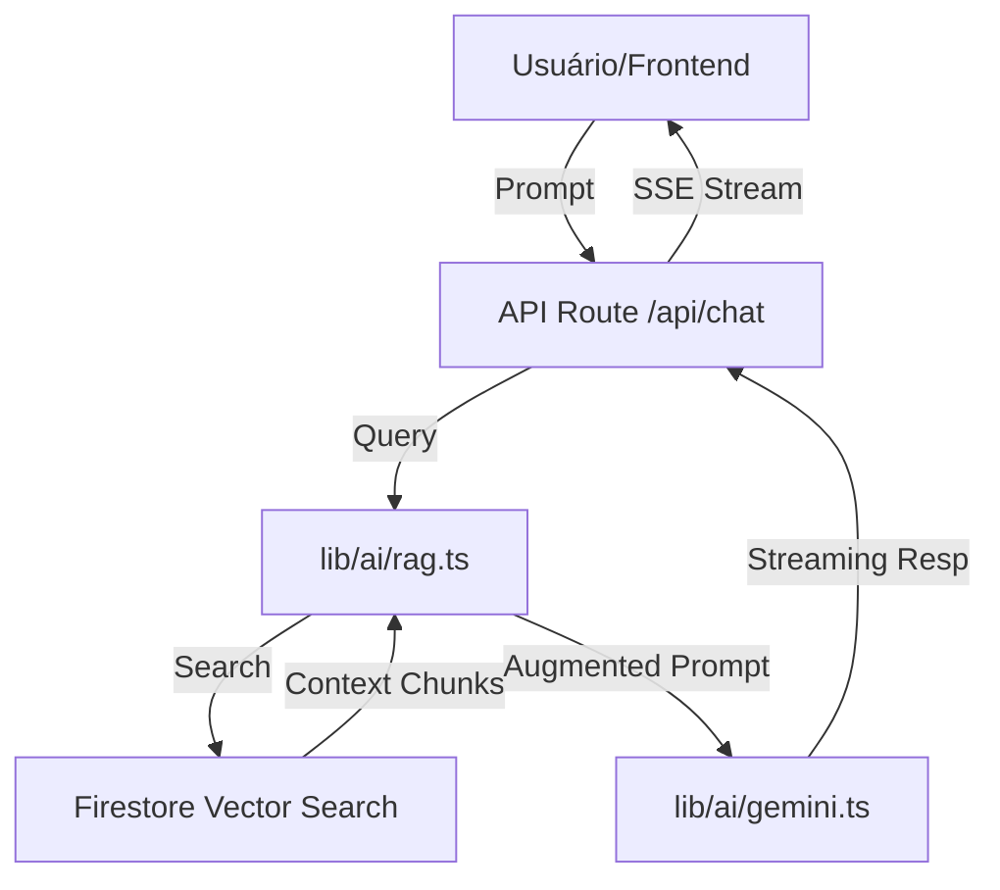

# 🗺️ Mapa da Mina: src/

Bem-vindo ao coração técnico do **Conselho de Funil**. Este diretório contém toda a lógica de aplicação, componentes de interface e integrações que fazem o sistema funcionar.

## 🏗️ Estrutura de Pastas

```
src/
├── app/            # Next.js App Router (Páginas, Layouts e API Routes)
├── components/     # Componentes React organizados por domínio
│   ├── ui/         # Componentes base (shadcn/ui)
│   ├── chat/       # Interface do Conselho de Estrategistas
│   ├── funnels/    # Wizard e visualização de funis
│   └── ...         # Outros domínios (analytics, layout, providers)
├── hooks/          # Hooks customizados para lógica de UI
├── lib/            # O "Motor" do sistema
│   ├── ai/         # Integração Gemini, RAG e Prompts
│   ├── firebase/   # Configuração e serviços Firestore/Auth
│   ├── stores/     # Estado global (Zustand)
│   └── utils.ts    # Utilitários gerais
├── styles/         # CSS Global e Design Tokens
└── types/          # Definições de tipos TypeScript (Interfaces de DB)
```

## 🚀 Arquitetura & Fluxo de Dados

O Conselho de Funil utiliza uma arquitetura moderna baseada em **Next.js**, **Firebase** e **Google AI**.

### Fluxo de Requisição (Chat/RAG)



1.  **Frontend**: Interface React com Tailwind e shadcn/ui.
2.  **Estado**: Zustand gerencia o estado da conversa e do wizard de funis.
3.  **Backend (API)**: Rotas do Next.js lidam com orquestração.
4.  **Data Layer**: Firestore armazena documentos e vetores de embedding (768d).
5.  **AI Layer**: Google Gemini 2.0 Flash para geração rápida de respostas.

## 🎨 Padrões de Código

- **Estilização**: Tailwind CSS com Design Tokens em `src/styles/design-tokens.css`.
- **Componentes**: Baseados no shadcn/ui, mantidos em `components/ui`.
- **Documentação**: Todas as funções exportadas em `lib/` devem possuir **JSDoc** em Português.
- **Estado Global**: Preferência por Zustand para evitar prop-drilling.
- **Tipagem**: Tipagem forte via TypeScript. Interfaces de banco de dados residem em `types/database.ts`.

## 🛡️ Método APC (Agent-Protocol-Contract)

Este projeto segue rigorosamente o método **APC** para garantir segurança e escala:

- **A**gents: Cada agente (Amelia, Dante, Paige, etc.) tem permissões específicas.
- **P**rotocol: O desenvolvimento é guiado por **Story Packs** isolados.
- **C**ontracts: Mudanças em diretórios protegidos devem respeitar os contratos em `.bmad/contracts/`.

**Regra de Ouro**: Nunca altere a lógica de negócio sem atualizar ou validar contra o contrato da Lane correspondente.

## 🛠️ Como Adicionar uma Nova Feature

1.  **Definição**: Identifique a Story e o Contrato da Lane envolvida.
2.  **Schema**: Se necessário, atualize `src/types/database.ts`.
3.  **Lógica**: Implemente as funções de serviço em `src/lib/` (ex: `src/lib/firebase/firestore.ts`).
4.  **UI**: Crie os componentes necessários em `src/components/`.
5.  **Rota**: Adicione a página ou API route em `src/app/`.
6.  **Docs**: Adicione JSDoc às novas funções e atualize este README se a estrutura mudar.

---

**Última Atualização**: 02 de Janeiro de 2026  
**Responsável**: Paige (Technical Writer)

